# XDF 2018 Workshop
## SDSoC, Computer Vision, and Machine Learning

### Introduction
------------

Welcome to the XDF 2018 SDSoC, machine learning, and computer vision
workshop!

The Xilinx SDx development environment is uniquely suited to
developing systems combining hardware-accelerated machine learning,
sensor input from a variety of sources, and accelerating custom
algorithms using FPGA fabric. By leveraging the tight coupling between
the CPUs and FPGA fabric in Xilinx's ACAP and SoC devices, designers
have the flexibility to adapt their hardware and platforms to achieve
unparalleled acceleration.

In this lab you will take video input from a USB3 webcam, run it through
the Deep-learning Processing Unit (DPU), and detect faces in the input
video stream using the DenseBox neural network as illustrated in the following figure. You will then output the video with an overlay
onto a DisplayPort-connected monitor. All of this will be built
targeting the low-cost, high performance, and low-power Ultra96 board
from Avnet on a Xilinx Zynq UltraScale+ ZU3 device.

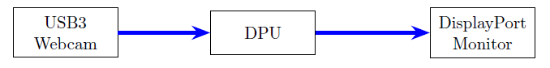

To move video in the system you will use the popular open-source
_gstreamer_ framework to sequence processing operations, all running on
Linux on the quad-core ARM Cortex-A53 processing subsystem.

No prior experience with SDSoC is necessary for this lab - all instructions are provided, although some knowledge of C++ programming is assumed. If you are unsure how to approach a particular step or sequence of operations please reach out to one of the lab assistants standing by to help. Alternatively, advanced users who are familiar with the SDSoC tool flow and environment may wish
to experiment on their own.

## Connecting to Amazon AWS
------------------------

In this lab exercise you will start an AWS EC2 m5.8xlarge instance and connect to it using either SSH or the Remote Desktop client. Once connected you will be able to run the Xilinx tools with all needed scripts and configurations.

For this event, each registered participant will be required to start
their own AWS instance.

### Log in to AWS and Start the Instance

You should have received a piece of paper which has the Account ID, IAM
user name, and password for a unique AWS AMI. If you don't have it, or
have lost it, please raise your hand and ask one of the lab assistants
for help.

Begin by using your web browser to open the following URL:
console.aws.amazon.com/ec2/v2/home?region=us-west-2#Instances:tag:Name=**\<your IAM user name\>**;sort=tag:Name

For example, if your user name is "user7", the correct URL would be:
https://console.aws.amazon.com/ec2/v2/home?region=us-west-2#Instances:tag:Name=User7;sort=tag:Name

Log in with your assigned account ID, user name, and password as shown
in the following figure:

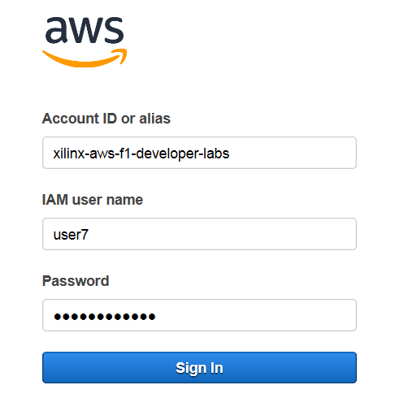

You will see a list of AWS instances. Select the instance associated
with your user name, noting that there are many attendees registered for
XDF and you may have to scoll a bit to find yours (there is a
search/filter function available at the top of the screen to enter your user name). One you've located it click **Actions** -\> **Instance State**
-\> **Start** as shown in the following figure:

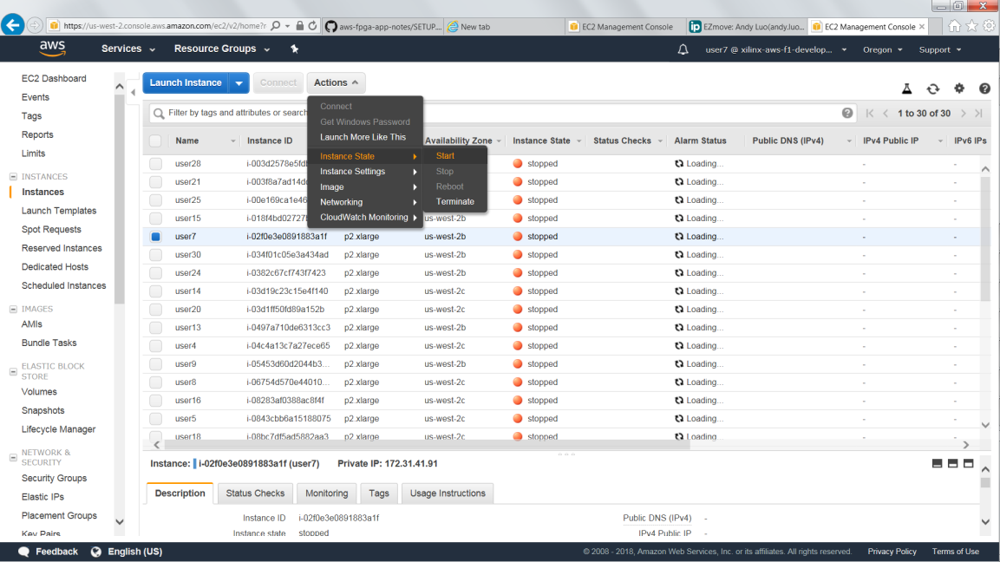

Each instance takes approximately 10 to 20 seconds to start, and you
will need to refresh your browser in order to see the status update.
Once the instance has booted the state will display as "running" and you
will see an IPv4 public IP address associated with your Amazon instance as shown in the following figure. Take note of this address as you will use it in
subsequent steps to connect to the instance and access the lab software
environment.

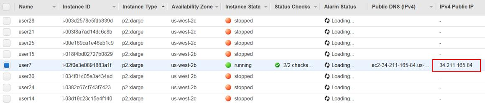

There are two ways to connect to the instance: SSH and RDP.

**Note:** This lab requires the use of the SDSoC GUI, and Xilinx has found connecting through RDP to generally be more responsive than SSH tunneling and/or VNC for AWS instances. As RDP clients are available on most systems, instructions for RDP are provided here.

### Connect to the AWS AMI Using RDP

The instance you started should be configured with an RDP server. To
connect:

From your local laptop, start a remote desktop client

-   **Windows:** press the Windows key and type "remote desktop"

    -   You should see the "Remote Desktop Connection" application in
        the list of programs

    -   If you do not, alternatively you can type **mstsc.exe** in the
        Windows run prompt

-   **Linux:** RDP clients such as Remmina and Vinagre are suitable

-   **macOS:** Use the Microsoft Remote Desktop app from the Mac App
    Store

In the remote desktop client, enter the public IPv4 address of your instance. If you are unsure where to find it please refer back to the prior figure.

**IMPORTANT:** Before connecting, set your remote desktop client to use
**24-bit or lower color depth**. This is a shared network environment
with many people on WiFi, your performance (and theirs) will be degraded
with higher bandwidth utilization.

On Windows, in the bottom-left corner of the connection prompt click
**Options**, then select the Display tab and set Colors to True Colors
(24-bit).

Click **Connect** (or equivalent) to connect to the remote system.

**Note:** You may see a message about untrusted connection certificates.
If so, click **Yes** to dismiss this message. Your remote desktop client
should prompt you to log in.

Log in with the following credentials:

-   User: **ubuntu**
-   Password: **xdf_sdsoc**

Note that it is possible that the username and password you were
provided for your use during the session may not match the above. In the
event of a discrepancy you must use the **provided login and password**.

It is possible that the RDP connection may fail on the first attempt.
Typically connecting a second time resolves the issue.

Open a new terminal as shown in the following figure:

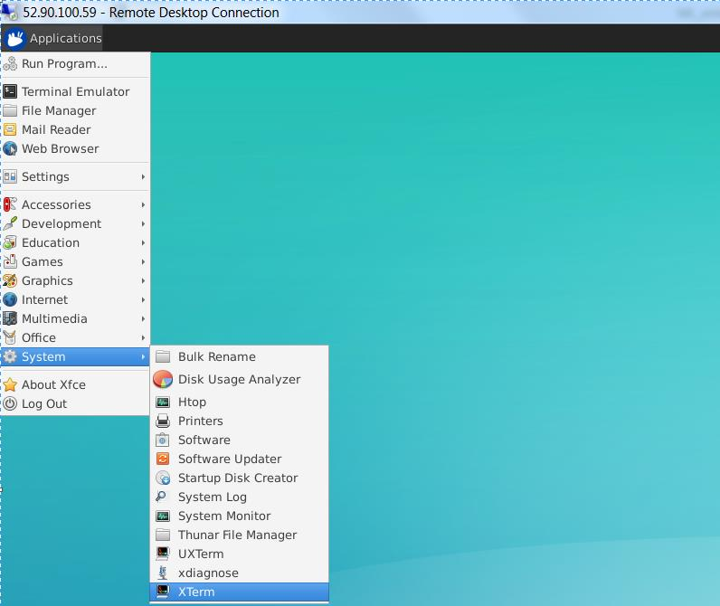

## Provided Design Files
---------------------

All design files for this lab exist under the the
**\~/XDF_Labs/SDSoC/** directory on the AWS AMI you were assigned.

Under this top-level source directory you will find four primary
directories: **lab_files**, **platform**, **workspace**, and
**solution**.

- The **lab_files** directory contains the source files you
will import to begin working on the lab.
- The **platform** directory contains all of the files necessary to target the Ultra96 board with SDSoC, including the contents of the root file system needed for
cross-compiling the gstreamer plugins.
- The **workspace** directory is currently empty but will be used for your target workspace.
- The **solution** directory contains, as its name implies, a ready-made
solution to the lab that is complete and working. It can be used for
reference if you get stuck on any step.

## Design Details
--------------

This lab targets an effectively empty hardware design containing only
the clocking and reset infrastructure needed to enable the device. For
your purposes here you will effectively ignore it as it consumes nearly no
FPGA resources. The USB3 and DisplayPort interfaces are implemented
using the hardened IP in the Zynq UltraScale+ Processing system. You will
interact with them using standard drivers built into the Linux kernel.

However, unfortunately engineering seldom lends itself to simple block
diagrams. In this example you have the following constraints:

-   Your neural network has been trained on 640x480 images using the RGB
    pixel format.

-   Your USB3 webcam will produce raw data, and at this resolution, but
    in the YUV 4:2:2 pixel format.

-   The DisplayPort controller in the Zynq UltraScale+ PS block requires
    that the output frame buffers be aligned to a 256-byte stride.

From these constraints you can draw two conclusions: you must convert
between the YUV 4:2:2 pixel format and RGB, and you must put the output
format into something that can be displayed by the hardware. To that end
you will work on the "real" block diagram shown in the following figure:

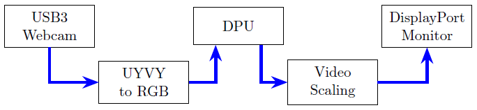

In this example design you will implement the three blocks not composed
of hard silicon (YUYV to RGB conversion, the DPU, and video scaling)
with a mix of accelerated hardware functions and software functions
using the SDSoC tool.

Before beginning to build the design with SDSoC it's important to think
about which blocks you intend to implement in hardware vs. which blocks
you intend to implement in software. In a real system you would likely
want to implement all of these as hardware blocks for performance, but
perhaps you have other algorithms to accelerate, etc. For this lab we
will use:

-   The DPU IP from Xilinx, which is provided as a "C-Callable IP
    Library" for the SDSoC tool. Xilinx provides a standard API to
    interact with the library, and the relevant portions of the hardware
    functionality are automatically accelerated using the FPGA fabric.

-   To convert from YUV 4:2:2 (hereinafter referred to as YUYV) to RGB
    you will use a standard C++ function accelerated into the FPGA
    fabric.

-   To scale the video to the display you will use software scaling in
    gstreamer. This is **not** the way to implement the system for
    maximum performance; your goal is to showcase the interoperability of
    SDSoC-accelerated components along with software processing. For
    best results please refer to the Xilinx xf::OpenCV
    hardware-accelerated OpenCV library.

### Theory of Operation: Pixel Format Conversion

Our Logitech webcam will provide YUYV data at up to
1080p resolutions, but to avoid an input scaling step you will configure
it to provide raw YUYV data at your requested 640x480 resolution. You  then
need to convert that data in memory to RGB data that your neural network
has been trained to understand.

Fortunately, converting between YUYV and RGB is a simple operation that
works very nicely with the stream-based processing capabilities of an
FPGA. In memory, the YUYV data is laid out as shown in the following figure, with each value represented by a single byte.

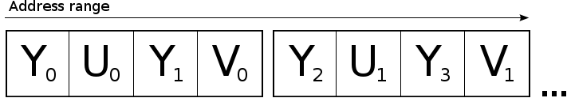

Because YUYV is a sparse format you can't convert pixel-by-pixel but rather using a full four-byte word (or, in other words, two pixels to two pixels). The equations for the conversion are as follows:

R_0 = 1.164 * (Y_0 - 16) + 2.018 * (U_0 - 128)

G_0 = 1.164 * (Y_0 - 16) - 0.813 * (V_0 - 128) - 0.391 * (U_0 - 128)

B_0 = 1.164 * (Y_0 - 16) + 1.596 * (V_0 - 128)

R_1 = 1.164 * (Y_1 - 16) + 2.018 * (U_0 - 128)

G_1 = 1.164 * (Y_1 - 16) - 0.813 * (V_0 - 128) - 0.391 * (U_0 - 128)

B_1 = 1.164 * (Y_1 - 16) + 1.596 * (V_0 - 128)

This pattern repeats throughout the image, making implementation with a
**for** loop quite simple.

Using fixed-point representations of the constant values in the FPGA
fabric results in an extremely small and efficient implementation that's
able to produce a new pixel value on each clock cycle, converting the
values easily without consuming valuable CPU processing time.

## Defining the Software Architecture
----------------------------------

Now that you have a general understanding of the system you will address the "nuts and bolts" of getting the system constructed. Video systems built with _gstreamer_ are built using **pipelines**, which are strings of processing elements, each one of which performs a particular function. Many functions and interfaces are available, but the details of gstreamer are beyond the scope of this lab. Suffice it to say that we will be building a pipeline with the topology indicated in the following figure:

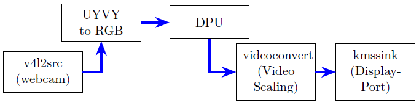

Each block in the prior figure will be implemented with a pre-compiled **shared object file**, or **.so**, that defines the interfaces, block behavior, etc. There are many topologies you can implement with SDSoC, but you will implement something like the following where both the YUYV to RGB and DPU functions call into a single hardware-accelerated library. This isolates, to the degree possible, the hardware
implementation from the _gstreamer_ implementation. Your full topology will look like the following figure:

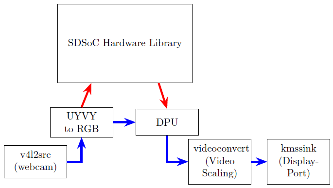

Now that you have a general understanding of the IPs you want to create
and their interfaces, it's time to package them up in a meaningful way
for use in SDSoC. You  will create a single library,
**libdpucore130_1152.so**, that contains both the DPU C-Callable IP
library functions and the hardware-accelerated pixel format conversion
function. This library will consume the **libdpu.a** library which
contains the DPU IP (and this is the general SDSoC flow for embedded
hardware libraries). If you are unfamiliar, .a file in C or C++ is a
*static archive*. This is a pre-compiled archive that contains, in your
case, both pre-compiled C++ function stubs and the source files to
recreate the DPU IP. This means that when using C-Callable IP with SDSoC
you don't need to worry about copying around the original IP sources or
dealing with instantiating the IP directly into the Vivado development
environment.

Xilinx provides pre-defined C++ functions that will map onto the
top-level interfaces of the DPU IP. For your lab you will add in
additional functions to enable the additional processing flows.

## Building the SDSoC Design
-------------------------

Begin by connecting to the AMI containing the lab source files. The
software environment has already been pre-configured, however, you need
to set an environment variable to point to the cross-compilation target
file system. This is to allow the development environment to parse and
link against the headers, libraries, etc. that will be present on your
target. This **sysroot** has been pre-built with the Xilinx PetaLinux
toolchain.

From a command prompt, enter the following:

    cd ~/XDF_Labs/SDSoC/platform/aarch64-xilinx-linux
    export SYSROOT=`pwd`

**NOTE:** For those unfamiliar with Linux syntax, the characters shown in the "export SYSROOT" line are the backtick character, typically found next to the number one on US keyboards, and are not the single quote character.

You will want to double check that the $SYSROOT environment variable is
set correctly as any errors here will result in compilation errors
later. Check with the "echo" command to ensure that it is correct:

    echo $SYSROOT
    /home/ubuntu/XDF_Labs/SDSoC/platform/aarch64-xilinx-linux

### Launch SDSoC

Launch the SDx development environment by running the following from the command line:

    sdx -workspace ~/XDF_Labs/SDSoC/workspace

From the SDx welcome screen, select the **Import Project** link. In the subsequent
dialog select "Eclipse workspace or zip file" and click "Next", as shown in the following figure:

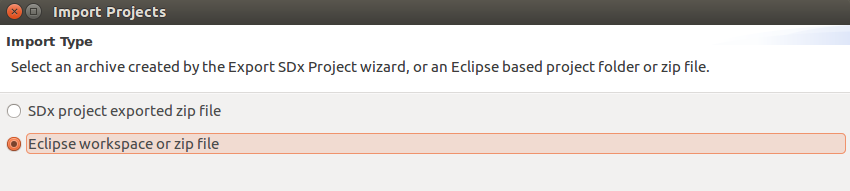

**NOTE:** If you have closed the initial welcome screen, you will be presented
with a blank workspace. Right-click within the "Project Explorer" pane
and select "Import". To launch the import wizard, expand the "General"
tab and select the "Existing Projects into Workspace" option and click "Next", as shown in the following figure:

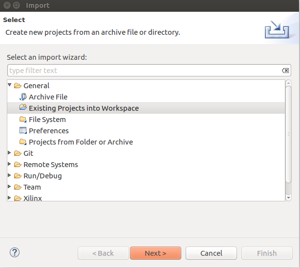


With the "Select root directory" radio button selected browse to the directory:

    /home/ubuntu/XDF_Labs/SDSoC/lab_files

Ensure that the following projects are selected:
- dpucore130_1152
- gstsdxfacedetect
- gstsdxpedestriandetect
- gstsdxcolorconvert

**NOTE:** Also ensure that the "Copy projects into workspace" option is
selected.

Your dialog should look similar to the following figure:

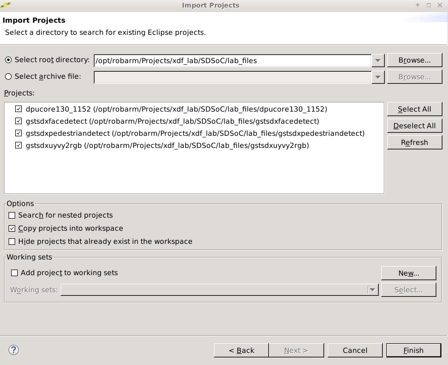

Click "Finish" to import all of the projects.

Note that two directories have been pre-installed into the workspace that do not exist by default. The first, a **libs** directory, contains support libraries for gstreamer and the DNNDK that you will link against to build your application. The second, an **ipcache** directory, contains cached hardware synthesis results to help speed up your implementation run (the AMI you are using for this lab has a relatively small number of processor cores, and your lab time is short).

### Working in the dpucore130 Project

In the SDx GUI, expand the **dpucore130_1152** project (if it isn't
already) and double click on the **project.sdx** file to open it.

The dpucore library includes the DPU and its associated software by
default, but you now need to add your YUYV to RGB function.

1. Right click on the 'src' folder and select **Import**, then **General** -\> **File System**.

2. Browse to the directory **/home/ubuntu/XDF_Labs/SDSoC/lab_files/template** and select the file **colorconvert.cpp**, importing it into the **src** folder of the DPU library.

3. Open the file by double clicking on it.
   Note that it contains the function to accelerate your YUYV to RGB conversion, called *colorconvert_accel*. However, also note the TODO notice at the bottom. Every accelerated function in SDSoC must have one (or more) **call sites**. In other words, it can't be accelerated in a vacuum, it must be called by something. Add a wrapper around that function (*hint: this is just the same function with a different name, passing its data directly to the colorconvert_accel function*). Something like:

``` {.c frame="lines" framesep="2mm"}
// Caller for the conversion function
void yuyv2rgb(yuyv_data *yuyv,
              rgb_data *rgb,
              int height,
              int width)
{
    colorconvert_accel(yuyv, rgb, height, width);
}
```

4. Save the file.

    Your last step is to tell SDx you want to move the *colorconvert_accel* function to hardware. To do that, from the main project page (which can be opened by double clicking on **project.sdx**)

5. Click on the lightning bolt icon (circled in the following figure) to select hardware functions to accelerate, and choose 'colorconvert_accel' from the list.

    Please note that when the dialog box opens the source cache is refreshed; EBS network latency can make this process take roughly 30-45 seconds so please wait a moment if the dialog box comes up with an empty list.

6. Ensure that both the "Data motion network clock frequency" and "Clock Frequency (MHz)" settings for the accelerator are both 300 MHz, as shown in the following figure:

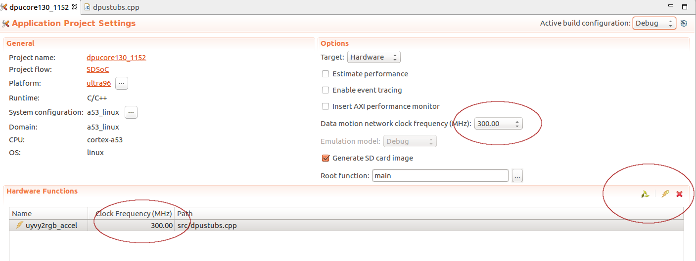

7. Click the hammer icon (build) in the toolbar menu to start the build process.

    This will take some time to complete. When it's done you will have a file **libdpucore130_1152.so** that contains the software API to communicate with the DPU, along with your hardware-accelerated color conversion function. You  can now link the other libraries against it.

**NOTE:** AWS resources are shared with other AWS users in the data
center, including elastic block storage (EBS). Processes running over
EBS may become I/O bound and take longer than they would on a local
desktop machine. You  may experience longer than normal build times when
running this lab in the cloud. To save lab time, cancel the build
and switch your workspace to the provided workspace with
pre-build hardware by selecting **File** -\> **Switch Workspace** -\> **Other** and browsing to it. The prebuilt workspace
is located at:

    ~/XDF_Lab/SDSoC/workspace_prebuilt

## Building the GStreamer Plugins
------------------------------

### Face Detector

Double click on the **gstsdxfacedetect** project in the "Project
Explorer" pane to open it, then click the build icon at the top of the
screen. This project should build in seconds.

### Pedestrian Detector

Double click on the **gstsdxpedestriandetect** project in the "Project
Explorer" pane to open it, then click the build icon at the top of the
screen. This project should build in seconds.

### YUYV to RGB

Double click on the **gstsdxcolorconvert** project in the "Project Explorer"
pane to open it. This project will build similarly quickly, but you have
to make a quick modification first. Most of a gstreamer plugin is
boilerplate; code that exists to interoperate with the library but that
doesn't impact the overall functionality (of course this is a gross
simplification, but for your purposes in this lab it's sufficiently
accurate). The important part is actually calling the
hardware-accelerated function!

The project is already set up to link against the .so file you generated
earlier, but you don't call the function in the C code. Under the 'src'
directory of the project open the **gstsdxcolorconvert.cpp** file and browse
to the TODO line (line 121). Here, call the function you defined in the
hardware library. It should look something like the **colorconvert** function in the following code sample:

``` {.c linenos="" frame="lines" framesep="2mm"}
static GstFlowReturn
gst_sdx_colorconvert_process_frames(GstSdxBase   * base,
                                GstSdxFrame ** in_frames,
                                GstSdxFrame  * out_frame)
{
    GstVideoInfo  *info = NULL;
    GstSdxFrame   *in_frame;
    GstVideoFrame *in_vframe, *out_vframe;
    yuyv_data     *in_data;
    rgb_data      *out_data;

    g_return_val_if_fail(in_frames != NULL &&
                        out_frame != NULL, GST_FLOW_ERROR);

    in_frame = in_frames[0];
    if (in_frame == NULL) {
        GST_WARNING_OBJECT (base, "colorconvert input frame is invalid");
        return GST_FLOW_ERROR;
    }

    in_vframe  = &in_frame->vframe;
    out_vframe = &out_frame->vframe;
    info       = &out_frame->info;
    in_data  = (yuyv_data *) GST_VIDEO_FRAME_PLANE_DATA (in_vframe, 0);
    out_data = (rgb_data *) GST_VIDEO_FRAME_PLANE_DATA (out_vframe, 0);

    // TODO: Add a function call to the YUYV accelerator here
    yuyv2rgb(in_data, out_data, GST_VIDEO_INFO_HEIGHT (info),
             GST_VIDEO_INFO_WIDTH (info));
    /********************************************************/

    GST_DEBUG_OBJECT(base, "colorconvert input frame processed");

    return GST_FLOW_OK;
}
```

With this function called, click the build icon at the top once again.
This library should also build in a matter of seconds.

## Assembling the Boot Files
-------------------------

You have now built a collection of **.so** files, and a bitstream, to run on
the board. These files need to be collected into an SD card image for
boot. You  can collect them from each project build area into a directory
to copy to an SD card image as follows:

    cd ~/XDF_Labs/SDSoC/workspace_prebuilt
    cp -r dpucore130_1152/Debug/sd_card .
    cp libs/* sd_card/
    cp gstsdxfacedetect/Debug/libgstsdxfacedetect.so sd_card/
    cp gstsdxpedestriandetect/Debug/libgstsdxpedestriandetect.so sd_card/
    cp gstsdxcolorconvert/Debug/libgstsdxcolorconvert.so sd_card/

**NOTE:** If you are using a different workspace than **workspace_prebuilt** then please ensure you use the correct path for the initial 'cd' command.

You also have an optional shell script available that can be run on the
board to automate the subsequent section. If you're interested in the
board setup that must be done to install and run custom gstreamer
plugins then please ignore it and proceed on, but if you want to add it
to your SD card you can install it thusly:

    cp ../solution/sd_card/facedetect.sh sd_card/
    cp ../solution/sd_card/pedestrian.sh sd_card/

Copy the complete contents of the **sd_card** directory onto your SD
card with scp, sftp, or a similar SSH-based file transfer utility. There
are many available and it's beyond the scope of this document to provide
instructions on each, but FileZilla on Windows and Linux (or command
line tools on macOS/Linux) are reliable options. If you don't have an SD
card slot available, or are otherwise unable to perform this step,
please ask one of the lab assistants for help (you can either help you
transfer the files or provide a pre-completed SD card image).

## Running on the Board
--------------------

Connect the serial terminal of the Ultra96 board to your laptop. Your OS
may need to automatically download the drivers for the USB UART device.
Open a terminal to the tty or COM port created by the UART driver at
115200 kbps. Insert the SD card into the Ultra96 board and power it on.
You should see boot messages displayed on the terminal. Do not interrupt
the boot process.

Once the board boots, log in with the username **root** and password
**root**.

At this point if you are only interested in seeing the application run
please run the **facedetect.sh** script from the command prompt:

    source /media/card/facedetect.sh

To run the pedestrian detector, kill it with CTRL-C and launch:

    source /media/card/pedestrian.sh

Otherwise, if you are interested in manually performing the steps please
continue on. To suppress kernel printk messages, which are output by
default by the SDx runtime and which will clutter the terminal, run:

    dmesg -n 1

You also need to install the shared objects to the correct places in the
file system. Run the following commands:

    cp libd* /usr/lib
    cp libgstsdxallocator.so /usr/lib
    cp libgstsdxbase.so /usr/lib
    cp libgstsdxcolorconvert.so \
       libgstsdxfacedetect.so \
       /usr/lib/gstreamer-1.0

The DisplayPort controller in the ZU+ devices supports multiple planes. We are
rendering the video to the "graphics" plane, but the console is on the "overlay"
plane. To make the overlay plane transparent we can run the modetest command
as follows (note that this will disable the output on the display; for this reason
we recommend you run this as part of the shell script instead of manually):

modetest -M xlnx -w 35:alpha:0 &

Finally, you can launch the gstreamer pipeline for face detection:

    gst-launch-1.0 \
        v4l2src io-mode=4 ! \
        video/x-raw,format=YUY2,width=640,height=480,framerate=30/1 ! \
        sdxcolorconvert ! \
        rawvideoparse format="bgr" width=640 height=480 framerate=30 ! \
        sdxfacedetect ! \
        videoscale ! \
        video/x-raw,format=BGR,width=640,height=480 ! \
        kmssink driver-name=xlnx sync=false

You should see output from the webcam piped to the display, with faces
clearly outlined by bounding boxes.

You can now launch the pedestrian detection similarly:

    gst-launch-1.0 \
        v4l2src io-mode=4 ! \
        video/x-raw,format=YUY2,width=640,height=480,framerate=30/1 ! \
        sdxcolorconvert ! \
        rawvideoparse format="bgr" width=640 height=480 framerate=30 ! \
        sdxpedestriandetect ! \
        videoscale ! \
        video/x-raw,format=BGR,width=640,height=480 ! \
        kmssink driver-name=xlnx sync=false

You should see output from the webcam piped to the display again, with
human figures clearly outlined by bounding boxes. Success!

## Summary
-------

In this lab you built a complete, end-to-end system incorporating
machine learning, computer vision processing acceleration, sensor input,
and display. You  have seen how the SDSoC tool allows you to easily build
complex topologies by leveraging existing, open-source frameworks and
seamlessly integrating them with hardware-accelerated functions in the
programmable logic.

You created a shared library containing the DPU IP along with some
additional support functions to perform color space conversion. The DPU
is a versatile processing engine; neural network models and trained
weights can be swapped at runtime or even run in parallel on the same
DPU instance - swapping your DenseBox-based face detection for another
algorithm (for instance YOLO, resnet50, or others) is a straightforward
software change.

You then wrapped the accelerated functions as gstreamer plugins,
allowing you to build flexible, integrated processing chains leveraging
a combination of hardware and software. GStreamer is of course not
required, but provides an often-familiar and extremely flexible
open-source framework for building flexible, adaptable designs.

Machine learning is a technology rapidly transforming nearly every
industry, at scales from the cloud to the edge. It doesn't, howver,
exist in a vacuum - data must be pre-processed, transformed, and
post-processed to take advantage of neural network acceleration, and
that processing is often computationally expensive with traditional CPU
processing, especially in embedded devices. Xilinx SDx tools are
uniquely suited to the task of allowing software developers to create
the next generation of adaptable systems, iterating quickly to meet
emerging design requirements.
